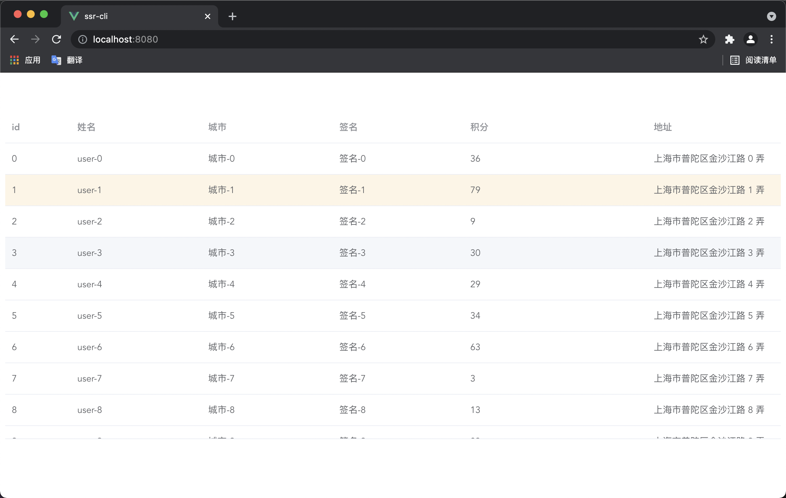

# 为什么要改造 SSR

目前 Vue 的 SSR 解决方案有很多比如`nuxt.js`、`Vapperjs`等，这些第三方框架已经给我做好了封装，为什么还需要自己来改造呢？原因有两个，一是这些成熟的框架都有自己的项目结构，必须按照它的规范来开发，而我们的项目大概率和它的结构不一致，改造成本会很大；另外一点是，第三方框架对于我们来说是个黑盒，出现奇奇怪怪的 bug，自己修复不了，并且无法自定义功能（日志上报、报警）。

# SSR 改造实战

[Vue.js 服务器端渲染指南](https://ssr.vuejs.org/zh/)

## 注意事项

> Vue 最低支持版本，以及以下 library 支持：
> vue & vue-server-renderer 2.3.0+
> vue-router 2.5.0+
> vue-loader 12.0.0+ & vue-style-loader 3.0.0+
> 如果先前已经使用过 Vue 2.2 的服务器端渲染 (SSR)，你应该注意到，推荐的代码结构现在略有不同（使用新的 > > > runInNewContext 选项，并设置为 false）。现有的应用程序可以继续运行，但建议你迁移到新的推荐规范。

## 准备工作

首先需要一个新的脚手架和可做展示的效果，我们拿`element ui`表格做展示。

### 新建脚手架

```sh
vue create ssr-cli
cd ssr-cli
npm run serve
```

### 制作表格

模拟数据

```javascript
async getData(dataSize = 1000) {
    // mock数据
    const mockFun = () =>
        new Promise((resolve) => {
            const _data = [];
            for (let i = 0; i < dataSize; i++) {
                _data.push({
                    id: i,
                    name: `user-${i}`,
                    address: `上海市普陀区金沙江路 ${i} 弄`,
                    city: `城市-${i}`,
                    sign: `签名-${i}`,
                    experience: Math.ceil(Math.random() * 100),
                });
            }
            // 延迟100ms模拟接口请求
            setTimeout(() => {
                resolve(_data);
            }, 100);
        });

    const tableData = await mockFun(1000);
    this.tableData = tableData;
}
```

表格最终效果如下：


## 入口文件

## 打包方式

## SSR 服务器

## 常见问题

<div class="aplayer no-destroy" data-id="热门" data-server="tencent" data-type="search" data-fixed="true" data-mini="true" data-listFolded="false" data-order="random" data-preload="none" data-autoplay="true" muted></div>
